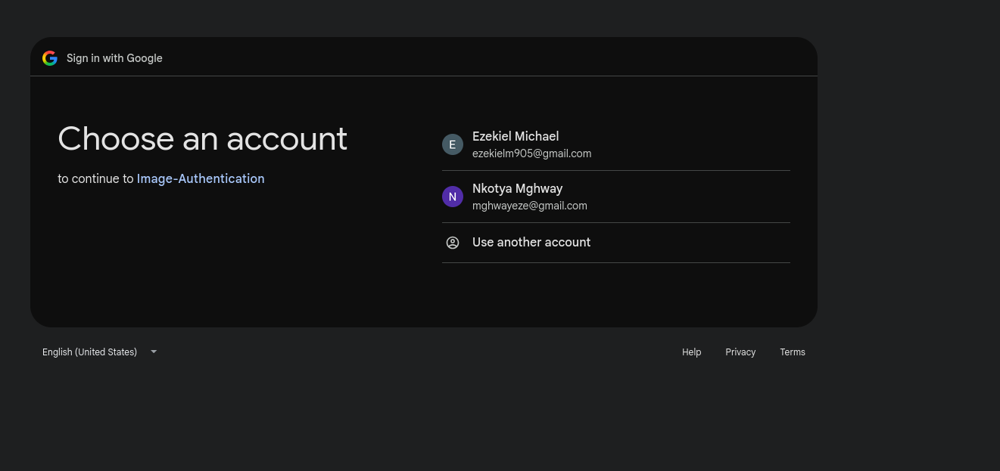
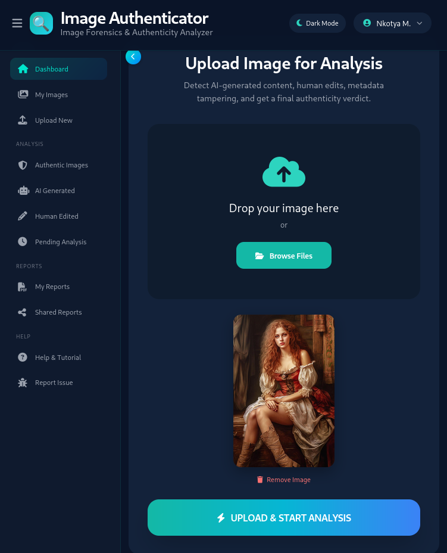

# AI-Powered Image Authentication System

> A hybrid digital image forensics and artificial intelligence system for analyzing image authenticity.

## Overview

The **AI-Powered Image Authentication System** is a web-based digital forensics application designed to analyze images and classify them as:

* **Authentic Image**
* **Human-Edited / Manipulated Image**
* **AI-Generated Image**

The system combines **digital image forensics** and **artificial intelligence** to provide a more detailed image authenticity assessment. In addition to classification, the system can identify and visualize suspected manipulated regions and provide contextual explanations of the analysis results through an integrated chatbot.

The application was developed as a full-stack system using **Django**, **Python**, machine learning, and digital image forensic techniques.

---

## Key Features

### 🖼️ Image Authentication

Users can upload an image for analysis.

The system analyzes the image and provides a final classification indicating whether it is:

* Authentic
* Human-Edited
* AI-Generated

---

### 🤖 AI-Generated Image Detection

The system uses a trained deep learning model to analyze whether an image is likely to be AI-generated.

The AI detection component is designed to distinguish between:

* **AI-generated images**
* **Real images**

---

### 🔍 Human Manipulation Detection

The system analyzes uploaded images for signs of traditional image manipulation or editing.

This component can identify evidence of possible image tampering and contributes to the overall authenticity analysis.

---

### 📍 Manipulation Localization

When suspected image manipulation is detected, the system provides visual analysis to help identify and localize suspicious or potentially edited regions within the image.

This allows users to investigate **where manipulation may have occurred**, rather than receiving only a classification result.

---

### 🧠 Intelligent Analysis Chatbot

The application includes an integrated chatbot that allows users to ask questions about the image analysis results.

For example, users can ask:

* Why was the image classified as AI-generated?
* Why does the system suspect image manipulation?
* What do the confidence scores mean?
* What does the highlighted area represent?
* How should the forensic analysis be interpreted?

The chatbot provides contextual explanations to help users better understand the system's analysis and results.

---

### 📊 Detailed Forensic Analysis

The system can provide detailed information about the analyzed image, including:

* AI detection confidence
* Human manipulation detection results
* Manipulation probability
* Final authenticity verdict
* Suspected manipulated regions
* Metadata analysis
* Image forensic results

---

### 🔐 Secure User Authentication

The application implements user authentication features to help protect user accounts and access to the system.

Features include:

* User registration
* Secure login and logout
* Email-based account activation
* Account verification
* Google account login using OAuth authentication

New users must verify their email address through an account activation link before activating their account.

---

### 📁 Analysis History

The system stores previous image analyses, allowing authenticated users to access their uploaded images and review past analysis results.

---

## System Workflow

```text
                        ┌──────────────────────┐
                        │    Upload Image      │
                        └──────────┬───────────┘
                                   │
                                   ▼
                     ┌──────────────────────────┐
                     │   Image Preprocessing    │
                     └──────────┬───────────────┘
                                │
                 ┌──────────────┼───────────────┐
                 │              │               │
                 ▼              ▼               ▼
        ┌──────────────┐ ┌──────────────┐ ┌──────────────┐
        │ AI Detection │ │Manipulation  │ │   Metadata   │
        │    Model     │ │   Detection  │ │   Analysis   │
        └──────┬───────┘ └──────┬───────┘ └──────┬───────┘
               │                │                │
               └────────────────┼────────────────┘
                                │
                                ▼
                    ┌─────────────────────────┐
                    │  Final Image Verdict    │
                    └───────────┬─────────────┘
                                │
              ┌─────────────────┼─────────────────┐
              │                 │                 │
              ▼                 ▼                 ▼
        ┌─────────────┐   ┌─────────────┐   ┌─────────────┐
        │ Authentic   │   │Human-Edited │   │AI-Generated │
        └─────────────┘   └─────────────┘   └─────────────┘
                                │
                                ▼
                    ┌─────────────────────────┐
                    │ Manipulation Localization│
                    │   & Result Explanation   │
                    └───────────┬─────────────┘
                                │
                                ▼
                    ┌─────────────────────────┐
                    │    AI Chatbot Support   │
                    └─────────────────────────┘
```

---

## Technology Stack

### Backend

* Python
* Django
* Django REST Framework
* PostgreSQL / SQLite

### Artificial Intelligence and Machine Learning

* PyTorch
* Torchvision
* ResNet
* Deep Learning
* Computer Vision

### Digital Image Forensics

* Image manipulation detection
* Metadata and EXIF analysis
* Error Level Analysis (ELA)
* Image authenticity analysis
* Manipulation localization
* Heatmap and forensic visualization

### Authentication and Security

* Django Authentication
* Email-based account verification
* Google OAuth
* User session management

### Frontend

* HTML
* CSS
* JavaScript
* Bootstrap / Tailwind CSS

---

## AI and Forensic Analysis

The system uses a hybrid approach rather than relying on only one detection technique.

### AI-Generated Image Detection

A deep learning model analyzes the uploaded image and estimates whether the image is likely to be:

* AI-generated
* Real

### Traditional Image Manipulation Detection

A forensic detection component analyzes the image for evidence of possible human editing or manipulation.

### Manipulation Localization

Forensic analysis results can be visualized to indicate areas of an image that may contain suspicious modifications.

### Metadata Analysis

The system extracts and analyzes image metadata to provide additional information relevant to image authenticity and forensic investigation.

---

## Final Classification

The final system classification can produce one of the following results:

### 🟢 Authentic Image

The image does not show sufficient evidence of being AI-generated or traditionally manipulated based on the system's analysis.

### 🟠 Human-Edited / Manipulated Image

The analysis detects evidence suggesting that the image may have been modified using traditional image editing or manipulation techniques.

### 🔵 AI-Generated Image

The deep learning analysis detects patterns indicating that the image is likely to have been generated using artificial intelligence.

> **Note:** The system provides an automated assessment and should be used as a decision-support and forensic analysis tool. Results should not be interpreted as an absolute guarantee of image authenticity or manipulation.

---

## Screenshots

### 🏠 Home Page


### 🔐 User Login you can use username and password or using Gmail




### 🖼️ Image Upload



### 📊 Analysis Results


### 🔍 Manipulation Localization


### 🧠 ChatBot explained

### 🤖 AI Detection Result


### 🧠 Analysis Chatbot for AI image


### Authentic Image


---

## Installation

### Prerequisites

Make sure the following are installed:

* Python 3.x
* pip
* Git
* PostgreSQL or SQLite
* Anaconda Environment

---

### Clone the Repository

```bash
git clone https://github.com/EzekielMichael/IMAGE_AUTHENTICATION_SYSTEM.git
```

Move into the project directory:

```bash
cd image-authentication-system
```

---

### Create a Virtual Environment

Linux:

```bash
python3 -m venv venv
source venv/bin/activate
```

Windows:

```bash
python -m venv venv
venv\Scripts\activate
```

---

### Install Dependencies

```bash
pip install -r requirements.txt
```

---

### Configure Environment Variables

Create a `.env` file in the project root.

Example:

```env
SECRET_KEY=your-secret-key
DEBUG=True

EMAIL_HOST_USER=your-email
EMAIL_HOST_PASSWORD=your-email-app-password

GOOGLE_CLIENT_ID=your-google-client-id
GOOGLE_CLIENT_SECRET=your-google-client-secret

DATABASE_URL=your-database-url
```

> **Security Warning:** Never upload `.env`, API keys, passwords, OAuth secrets, or private credentials to GitHub.

Add the following to `.gitignore`:

```text
.env
venv/
__pycache__/
*.pyc
db.sqlite3
media/
staticfiles/
```

---

### Run Database Migrations

```bash
python manage.py makemigrations
python manage.py migrate
```

---

### Create an Administrator Account

```bash
python manage.py createsuperuser
```

---

### Run the Development Server

```bash
python manage.py runserver
```

Open:

```text
http://127.0.0.1:9000/
```

---

## Project Structure

```text
├── README.md
├── imageAuthentication
│   ├── authenticate
│   ├── db.sqlite3
│   ├── imageAuthentication
│   │   ├── __init__.py
│   │   ├── settings.py
│   │   ├── urls.py
│   ├── manage.py
│   └── media
│       ├── db.sqlite3
│       ├── outputs
│       ├── reports
│       └── uploads
├── photoholmes
│   └── src
│       └── photoholmes
│           ├── __init__.py
└── requirements.txt

```

> Update this structure to match your actual project files before publishing.

---

## Security Considerations

The project includes authentication and account verification features, but sensitive configuration values must be protected.

Before publishing the project:

* Do not upload `.env`
* Do not upload secret API keys
* Do not upload Gmail passwords
* Do not upload Google OAuth client secrets
* Use environment variables for sensitive configuration
* Set `DEBUG=False` in production
* Configure `ALLOWED_HOSTS`
* Use HTTPS in production
* Keep dependencies updated
* Review file upload security controls

---

## Key Skills Demonstrated

This project demonstrates practical skills in:

* Cybersecurity
* Digital forensics
* AI and machine learning
* Computer vision
* Deep learning
* Image authenticity analysis
* Image manipulation detection
* Manipulation localization
* Explainable analysis and AI-assisted user support
* Python programming
* Django web development
* User authentication
* Email verification
* Google OAuth integration
* Database management
* Secure web application development
* Full-stack application development

---

## Future Improvements

Potential future improvements include:

* Support for additional AI-generated image models
* Improved cross-model generalization
* Expanded manipulation detection methods
* Improved localization accuracy
* C2PA / Content Credentials support
* Batch image analysis
* REST API
* Role-based access control
* Analysis report export
* Docker deployment
* Cloud deployment
* Model explainability improvements
* Improved AI chatbot capabilities

---

## Author

**Ezekiel Michael Juma**

BSc in Cyber Security and Digital Forensics Engineering

**Areas of Interest:**

* Cybersecurity
* Penetration Testing
* Web Application Security
* Digital Forensics
* Artificial Intelligence
* Machine Learning
* Python
* Django
* Flutter Development

📧 **Email:** [ezekielmichaeljuma1st@gmail.com](mailto:ezekielmichaeljuma1st@gmail.com)

🔗 **GitHub:** https://github.com/EzekielMichael

🔗 **LinkedIn:** www.linkedin.com/in/ezekiel-michael-93234a2bb

---

## Academic Project

This project was developed as part of my academic and practical work in **Cyber Security and Digital Forensics Engineering**.

It demonstrates the integration of:

**Cybersecurity + Digital Forensics + Artificial Intelligence + Full-Stack Web Development**

---

## Disclaimer

This project is intended for research, educational, and authorized forensic analysis purposes.

The results generated by the system should be interpreted as automated analytical assessments and supporting forensic indicators. They should not be treated as absolute proof of image authenticity, manipulation, or AI generation without appropriate human review and additional forensic investigation.
